# BryggIO

BRYGGANS BRYGGERI's very own brewery control software.

Currently under heavy developement.
The goal is to develop a stand-alone pub-sub backend with which any client can communicate and thereby control the brewery hardware.

## Project overview

_In this section we give a high-level overview of BryggIO's architecture.
It is intended to introduce new potential contributors to the application and underlying design choices._

### Structure

The repo contains four crates (a crate is a Rust library or executable):

- `bryggio_core`: The main library where most functionality is implemented.
- `bryggio_supervisor`: The main executable that is running during the brewing process. It is a very small crate, that starts up and runs a BryggIO supervisor client,
  which controls the brewing process.
- `bryggio_sensor_box`: A separate executable that controls an external sensor interface. Essentially a smaller version of `bryggio_supervisor`.
- `bryggio_cli`: A command line tool which handles installation and allows for debugging communication with the `bryggio_supervisor`.

### Short note on language choice

BryggIO is written in a language called [Rust](https://www.rust-lang.org/).
I don't really find the choice of language particularly interesting but Rust is still a rather niche language, prompting a brief motivation for choosing Rust.
The language candidates I considered were: Python, C, C++ and Rust.
To me, Rust have some properties making it the language -- among the ones I know -- best suited for an application like this.

These are:

- **Robustness:** Rust is often described as safe. BryggIO will initially be run on local networks, making safety in the sense of security less important.
  However, safety is also tightly coupled with robustness.
  Our goal is to produce an application that just works, and keeps on working. Rusts expressive type system, pedantic compiler and lack of exceptions is a perfect match for BryggIO.
  It is hard to make the code compile, but when it finally does, you can trust it to a large extent.
  The same thing does not apply to the other languages considered.

- **Modern dependency management:** Rust comes with a modern package manager called "Cargo".
  It makes it easy to build the source code and importantly, to include third-party dependencies.
  The former is particularly important to make it easier for people to contribute.
  Python has similar functionality, while C and C++ do not.

- **Low-level:** The target platform for BryggIO is a Raspberry Pi (rbpi), which in this context is hardly embedded, but in the future we will likely end up with some clients running on microcontrollers.
  This rules out Python[^python_embedded]. C and C++ certainly have better embedded support but Rust has good enough (and growing) support to not disqualify it based on this property.
  Furthermore, though not embedded, the rbpi is resource constrained, making a language without a runtime preferable[^lang_eff].

### Components

The automated brewing process can be quite simple.
The foundation of it is temperature control. We observe temperature measurements and control the output of a heating element to follow a target temperature.

In BryggIO, we have modelled this process with three component types: _sensors_, _actors_ and _controllers_.
A sensor is sort of a passive, independent component, which intermittently emits a measurement.
An actor is something that we can control, like a heating element, a pump, et c; something that can be turned on and off.
Both sensors and actors are associated with real hardware.
A controller is an abstract component. It listens for measurement from a sensor, computes a signal that it sends to an actor, in order to reach a set target.



The component types are represented in Rust's type system as _traits_, which are like _interfaces_ in other languages.
A trait defines common functionality that a set of concrete types share.
For example, the `Sensor` trait, defined in `bryggio_core::sensor`, looks like this:

```rust
pub trait Sensor: Send {
    fn get_measurement(&mut self) -> Result<f32, SensorError>;
    fn get_id(&self) -> String;
}
```

We make a concrete type become a sensor type by implementing the `Sensor` trait, e.g. for a dummy sensor that we use for prototyping:

```rust
pub struct DummySensor {
    pub id: String,
    latest_value: f32,
    delay: Duration,
    rng: Normal<f32>,
}

impl Sensor for DummySensor {
    fn get_measurement(&mut self) -> Result<f32, SensorError> {
        let measurement = self.latest_value + self.rng.sample(&mut thread_rng()) / 10.0;
        self.latest_value = measurement;
        sleep(self.delay);
        Ok(measurement)
    }
    fn get_id(&self) -> String {
        self.id.clone()
    }
}
```

NB: Rust does not have object-oriented inheritance. We don't have a "sensor base class/type" but rather a set of functions that each sensor type must provide.

Using the trait system enables us to define types for every sensor that we want to use and still have a common interface for them.
There are corresponding traits for actors and controllers.

We have imposed an invariant that each controller has a single actor and a single sensor.
This may seem restrictive but remember that, for instance, what constitutes a sensor has a wide interpretation.
Let's say we want to use two thermometers instead of one, and control their average temp.
Well, then we'll simply define a new concrete sensor type `AverageSensor` which internally reads the two temp's,
computes the average and sends that "meta-measurement" to the controller.
That is, we get the more complex functionality that we want but still uphold the invariant.

Another restriction is that an actor is always associated with a controller.
That is, while you could imagine two modes of actor operation: an automated actor, run by a controller and a manual actor that is turned on/off, the API does not allow for the latter.
This is for safety, the actors control the high-power hardware, so it is reasonable to only have one way to do it.
For the kind of simple manual control, we have a manual controller that acts as a middle man, yet still conforms to the design pattern.

### Publish-subscribe pattern

For communication between components such as sensors and controllers we use a _publish-subscribe_ pattern, which you can read about [here](https://ably.com/topic/pub-sub).
The gist of it is that components don't communicate directly with each other.
Instead, components act like _clients_, which communicate via a central server.
A client can publish messages to the server, messages which are tagged with a _subject_.
Clients receive messages by subscribing to subjects.
In this centralised way, clients can communicate without really having knowledge of each other.



For instance, when a sensor makes a measurement it simply publishes a message with subject `sensor.temp_sensor_1.measurement` containing the measurement.
Any other interested client -- i.e. that subscribes to this topic -- receives this message. This can be a controller client, which uses it to publish a new control signal,
or even a web UI that merely displays the value.

The pub-sub pattern makes clients more independent, and new clients can be added without having to update the existing set of clients.
Furthermore, the communication is language agnostic, one could for instance write a, say, twitter bot in Python that listens to the server and makes updates about the brewing process.

The pattern is also encoded in Rust's type system. All components -- now clients -- implement the `PubSubClient` trait in `bryggio_core::pub_sub`.
We take further advantage of Rust's generic type system by providing generic implementations for the different component types.
In Rust it is possible to make a generic implementation for all types that implements a second trait.
This allows us to reduce code repetition by, for instance, providing a common implementation of the `PubSubClient` trait for each type that implements the `Sensor` trait.

For the actual pub-sub system we use a protocol called [NATS](https://nats.io/). NATS is really just a protocol but it also comes with a server implementation that we use in BryggIO.
A pub-sub server is a complex piece of software so it is nice to use an existing solution.
Other alternatives exist, like [MQTT](https://mqtt.org/), but so far we are quite happy with NATS.

Pub-sub is well-suited for this application. With that said, there are some processes that require more direct communication, i.e. with acknowledgements.
NATS provide this out-of-the-box, with the [request-reply](https://docs.nats.io/nats-concepts/reqreply) feature.
A request message can be explicitly responded to, this is vital for messages that can't be lost (like shutting down some high-power hardware).

### The supervisor client

Since we use the pub-sub pattern we could in principle have one executable for every client, and run them in separate processes.
This would not be convenient however, so instead we have a special `Supervisor` client which is run as an executable.
The supervisor is responsible for starting and monitoring all our basic clients, like sensors, actors and controllers.
Via pub-sub messages we can also shut-down and start new clients during the brewing process.

### User interface (UI)

BryggIO intentionally does not come with a UI. A clear design goal is to have a full decoupling between frontend and backend.
The beauty of pub-sub is that any external application, like a UI, with a working NATS client can participate with any part of the brewing process.
We are developing a web-based UI, [BryggUI](https://github.com/BryggansBryggeri/bryggui), but whereas BryggIO is general and configurable,
the web UI is tailored to a specific brewery setup (our own).

### Hardware agnosticism

The goal is to make BryggIO run independently of the underlying hardware.
The motivation for this is two-fold:
Firstly: the actual hardware (an rbpi) is not set in stone and we want to design for flexibility from the get go.
Secondly, we want BryggIO to run as close as possible on ordinary computers, which lack the hardware requirements.
This makes the development experience much better since it is tedious to work directly on the actual hardware when prototyping.

We achieve this by conforming to the excellent [embedded-hal](https://github.com/rust-embedded/embedded-hal) (hardware abstraction layer) crate,
which defines a set of traits that describes the general behaviour of the hardware we want to use.
The BryggIO logic only interacts with the embedded-hal traits, while each hardware target that we want to support provides concrete imlementations of the traits,
enabling a separation between hardware interface and logic.

Currently, we have a hardware implementation for the rbpi.
This is almost completely third-party code, an extra benefit of conforming to the semi-official embedded-hal standard,
adding more boards and microcontrollers will be made significantly easier because of this.

We also have a dummy hardware implementation for developing on ordinary computers.
This "hardware" uses random number generators (rng's) for sensors and no-ops for GPIO pins, thus requiring no physical hardware.
As a side not, it would be a fun project to build a hardware emulator, that is a more advanced dummy hardware implementation,
that keeps track of an internal state which can be queried.

## Issues/Road map

- **Asynchronicity:** This application is async. in nature; sensors publish measurements at semi-random interval, triggering controllers to compute a new signal, which actors react to.
  The entire design would be much more intuitive if we managed to make it async.
  We have done some minor work exploring async. but much more remain to be done here, see [Tracking issue: Async](https://github.com/BryggansBryggeri/bryggio/issues/55).
- **Permanent data logging:** Currently, no data is stored. We will start out with some simple, writing to file and from there explore proper database options, see [db tracking issue](https://github.com/BryggansBryggeri/bryggio/issues/71).
- **BryggIO protocol:** The system of subjects that structure the communication have grown organically.
  Some work should be dedicated to create a more principled protocol, see the [issue](https://github.com/BryggansBryggeri/bryggio/issues/106).
- **1.0 version:** For a more detailed version, see the [Github project](https://github.com/BryggansBryggeri/bryggio/projects/2).

## Installation

Before the first release we will not publish any binaries, see [Build from source](#build-from-source)

### Build from source

- [Install rust and Cargo](https://www.rust-lang.org/tools/install). Rust and Cargo are provided by official distributions.

- Build targets `bryggio-supervisor`, `bryggio-cli` from source.

  ```bash
  git clone git@github.com:BryggansBryggeri/bryggio.git bryggio
  cd bryggio
  cargo build
  ```

### Install NATS server

either from the [website](https://nats.io/download/) or by running (rather buggy right now)

```bash
cargo run --bin bryggio-cli install
```

Installation is a fancy word for simply downloading the `nats-server` executable.
Do this by manual download from the link above, or the `bryggio-cli install` command.
The latter figures out what OS you are running, and downloads the corresponding executable.
This is the preferred method, the end-goal is to use the CLI for a complete install of the entire BryggIO app.
It is though -- as stated -- still in development.

## Configuration

The `bryggio-supervisor` executable expects a JSON file which specifies general settings, and importantly **the path to the `nats-server` binary** (that you downloaded in the install step).
See `sample-bryggio.json` for an example.

## Run

The `bryggio-supervisor`, starts up a `nats-server` in a separate process and then runs a supervisor pub-sub client which,
listening to special command subjects, starts and stops other clients like sensors, actors and controllers.

There are two ways to run the supervisor:

```bash
# This will build the executable (i.e. recompile if there are code changes) and run it
cargo run --bin bryggio-supervisor -- run <path_to_bryggio_config_file>
# ... while this will simply run the executable created in the build step.
./target/<profile>/bryggio-supervisor run <path_to_bryggio_config_file>
```

## Build for and run on rbpi

We use [`cross`](https://github.com/rust-embedded/cross) for cross compilation.
To use it, install and setup Docker then install `cross`.

You can get Docker from [here](https://docs.docker.com/get-docker/),
if you're on a Debian like distro this will perform the setup:

```bash
sudo apt install docker.io
sudo systemctl start docker
sudo chmod 666 /var/run/docker.sock
```

Install `cross` through Cargo:

```bash
cargo install cross
```

Build the required executables

```bash
# In the bryggio repo root
cross build --target=armv7-unknown-linux-musleabihf
```

Move the resulting executable
(`target/armv7-unknown-linux-musleabihf/<build-mode>/bryggio-supervisor`) and
`rbpi-nats-server` (you need to download the Arm version of it)
to the rbpi, as well as the config files listed in [Configuration](#configuration)

On the rbpi run:

```bash
sudo ./bryggio-supervisor <path_to_bryggio_config_file>
# E.g.:
# sudo ./bryggio-supervisor run sample-bryggio.toml
```

`sudo` is required for GPIO manipulation.

## Docs

The documentation is generated by running

```bash
cargo doc --document-private-items --no-deps --open
```

[^python_embedded]:
    This is not strictly true. Options exist, such as [MicroPython](https://micropython.org/).
    I have not considered it though since I'm not excited about taking up space with a runtime, especially one which does not satisfy the robustness property.

[^lang_eff]: [Energy Efficiency across Programming Languages](https://sites.google.com/view/energy-efficiency-languages/home)
